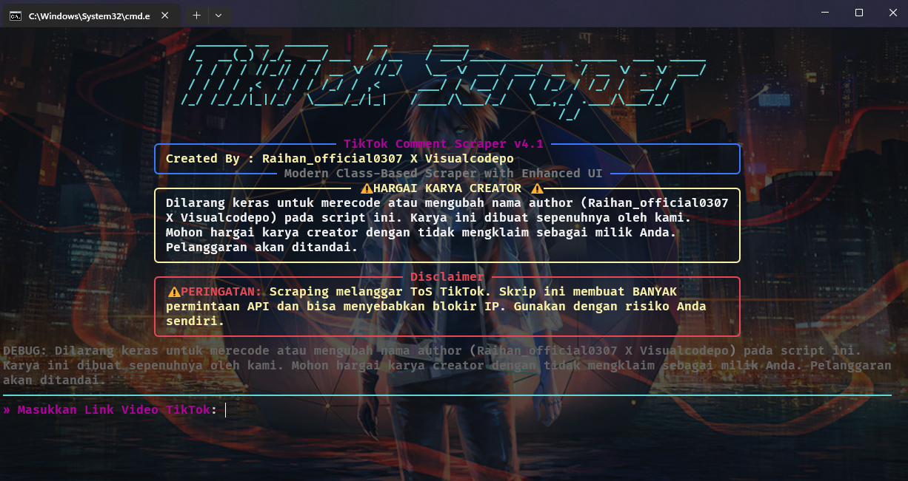

# 💬 TikTok Comment Scraper

[](https://python.org)
[](LICENSE)
[](https://github.com/Dikrey)
[]()

Sebuah command-line tool yang powerful dan bergaya untuk mengambil semua komentar dan balasan dari video TikTok mana pun. Dibangun dengan Python, scraper ini menampilkan antarmuka CLI yang indah dan berwarna-warni (dengan library `rich`), serta mengekspor data ke format **JSON** dan **Excel**.

Created by: [Raihan_official0307](https://github.com/Dikrey) X [Visualcodepo](https://github.com/Dikrey).


---

## 🌟 Fitur-Fitur

✅ **Antarmuka CLI yang Cantik**: Nikmati pengalaman scraping yang menyenangkan dengan tampilan terminal yang berwarna, progress bar, dan tabel informasi yang rapi.

✅ **Ekstraksi Data Lengkap**: Ambil semua komentar utama beserta semua balasannya (replies), termasuk nama pengguna, teks komentar, jumlah like, dan waktu pembuatan.

✅ **Statistik Video**: Dapatkan informasi detail tentang video seperti jumlah **views**, **likes**, **shares**, dan caption.

✅ **Format Ekspor Ganda**: Simpan hasil scraping dalam dua format populer:
- **JSON**: Struktur data terorganisir yang cocok untuk pengembang.
- **Excel**: Tabel data yang rata, siap untuk dianalisis di spreadsheet.

✅ **Arsitektur Berbasis Class**: Kode yang terstruktur dengan baik, mudah dibaca, dan mudah untuk dikembangkan lebih lanjut.

✅ **Mudah Digunakan**: Cukup jalankan satu perintah dan ikuti petunjuknya. Tidak perlu pengaturan yang rumit.

---

## 🖼️ Demo / Screenshot

Sebuah gambar menceritakan seribu kata. Berikut adalah cuplikan scraper saat beraksi:



---

## ⚙️ Prerequisites

Sebelum menjalankan, pastikan Anda telah menginstal:

-   **Python 3.8+** atau versi lebih tinggi.

---

## 📦 Instalasi

Ikuti langkah-langkah di bawah ini untuk mengatur lingkungan Anda:

1.  **Clone repositori ini:**
    ```bash
    git clone https://github.com/Dikrey/tiktok-scraper.git
    cd tiktok-scraper
    ```

2.  **Instal library yang dibutuhkan:**
    ```bash
    pip install requests pandas pyfiglet rich jmespath
    ```
3. **Instal Otomatis**
   ```bash
   python server.py
   ```    

---

## 🚀 Penggunaan

Menjalankan scraper sangat sederhana:

1.  Eksekusi script dari terminal Anda:
    ```bash
    python tiktok_scrapper.py
    ```

2.  Program akan menampilkan banner dan meminta Anda untuk memasukkan link video TikTok. Tempelkan URL dan tekan **Enter**.

3.  Duduk dan lihat keajaiban terjadi! Progress bar akan menunjukkan status pengambilan data.

---

## Output
Contoh output untuk json:

```json
{
            "cid": "7554751430977897223",
            "username": "Siapa?",
            "nickname": "Anony",
            "comment": "alat nya seharga beat🥶🔥\nthe real modder terniat semangat min🙌🏻🔥",
            "create_time": "2025-09-27 12:54:05 UTC",
            "avatar": "https://p16-sign-va.tiktokcdn.com/tos-maliva-avt-0068/6e8b361304d6c699d6665377b4892193~tplv-tiktokx-cropcenter:100:100.jpg?dr=14579&refresh_token=9686fce2&x-expires=1761393600&x-signature=GPva2XHVLaMnAlqbzwjaokV1BgI%3D&t=4d5b0474&ps=13740610&shp=30310797&shcp=ff37627b&idc=my",
            "digg_count": 17,
            "total_reply": 1,
            "replies": [
                {
                    "cid": "7555830389871051536",
                    "username": "Siapa?",
                    "nickname": "Anony",
                    "comment": "makanya ga usah pada ngeluh harga mahal karena ilmu dan alatnya ga murah😹😭",
                    "create_time": "2025-09-30 10:41:02 UTC",
                    "avatar": "https://p16-sign-sg.tiktokcdn.com/tos-alisg-avt-0068/0edb40366f2c6b2123ae8153596b3dbc~tplv-tiktokx-cropcenter:100:100.jpg?dr=14579&refresh_token=43baa39a&x-expires=1761393600&x-signature=EgoA1CLQYVIrvLMnuwg9IFJQztU%3D&t=4d5b0474&ps=13740610&shp=30310797&shcp=ff37627b&idc=my",
                    "digg_count": 1,
                    "total_reply": null,
                    "replies": []
                }
            ]
        }, 
```
---


## ⚠️ Disclaimer

**PENTING:** Scraping data dari TikTok melanggar **Syarat dan Ketentuan (ToS)** mereka. Penggunaan script ini dapat menyebabkan pemblokiran sementara atau permanen pada alamat IP Anda. Gunakan alat ini dengan **risiko Anda sendiri** dan bertanggung jawablah. Saya tidak bertanggung jawab atas penyalahgunaan script ini.

---

## 📄 File Output

Setelah proses selesai, scraper akan menghasilkan dua file:

1.  `tiktok_comments_[VIDEO_ID].json`
    -   Berisi data lengkap dalam format JSON yang terstruktur, termasuk komentar utama dan balasan yang bersarang (nested).

2.  `tiktok_comments_[VIDEO_ID].xlsx`
    -   Berisi data yang telah diratakan (flattened) ke dalam lembar kerja Excel, memudahkan analisis dan penyortiran.

---

## 🤝 Berkontribusi

Kontribusi adalah hal yang membuat komunitas open-source menjadi tempat yang luar biasa untuk belajar, menginspirasi, dan menciptakan. Setiap kontribusi yang Anda buat akan sangat dihargai.

Jika Anda memiliki saran untuk meningkatkan proyek ini, jangan ragu untuk membuat *fork* repositori dan buat *pull request*. Anda juga bisa membuka *issue* dengan tag "enhancement".

---

## 📜 Lisensi

Proyek ini dilisensikan di bawah Lisensi MIT. Lihat file `LICENSE` untuk detail lebih lanjut.

---

## 👨‍💻 Author

Dibuat dengan ❤️ oleh [Raihan_official0307](https://github.com/Dikrey) X [Visualcodepo](https://github.com/Dikrey).
